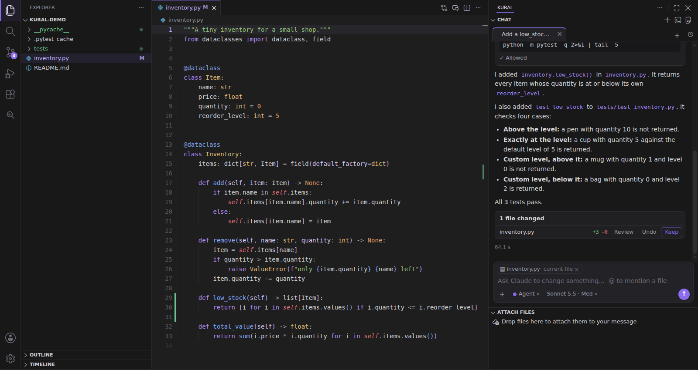
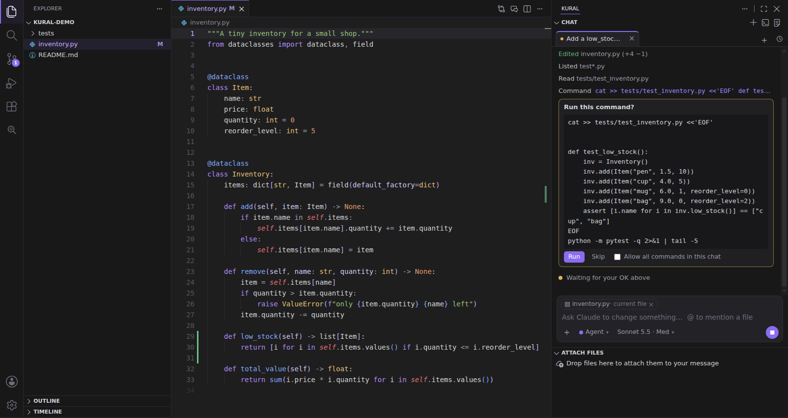
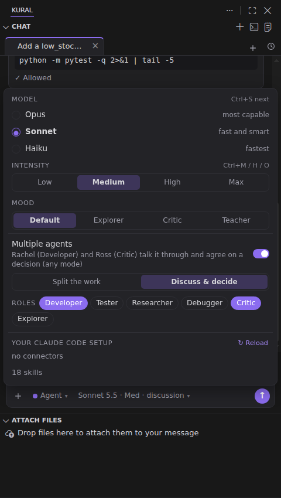
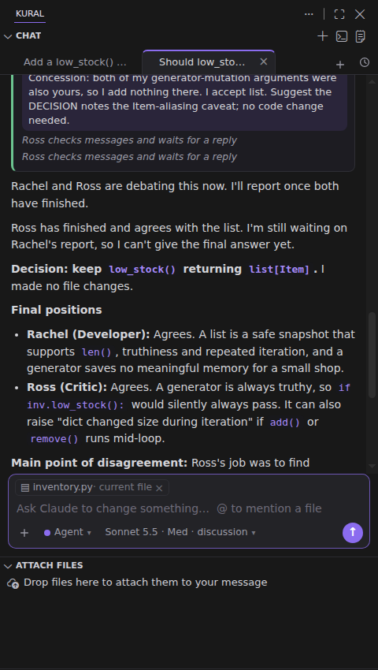
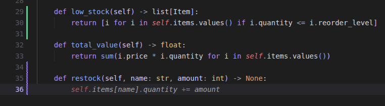
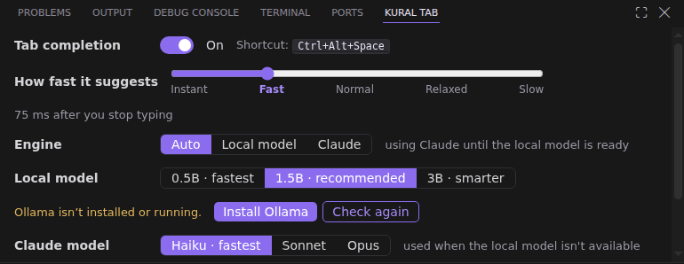
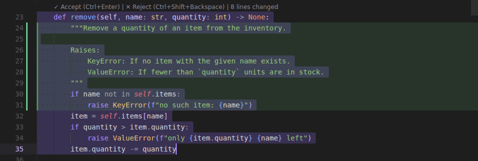

<p align="center">
  
</p>

<h1 align="center">Kural Code Editor</h1>

<p align="center">
  A code editor with Claude built in, in the style of Cursor.<br>
  It uses <b>your Claude Code login</b>, so there's no API key to set up.
</p>

<p align="center">
  <a href="https://github.com/adithyakumarcr/kural/releases"></a>
  <a href="https://github.com/adithyakumarcr/kural/actions/workflows/build.yml"></a>
  
  
  
</p>



## What is Kural?

Kural is [VSCodium](https://vscodium.com) (the open-source build of VS Code) with Claude built in.
Everything you know from VS Code works the same: extensions, themes, settings, the terminal, Git.
On top of that, Kural adds:

- **A chat that edits your code.** Ask for a change; Claude reads your project, edits files, runs your tests, and you
  keep or undo each change.
- **Tab completion.** Grey suggestions as you type; **Tab** accepts.
- **Inline edit (Ctrl+K).** Select code, say what to change, review it red/green.
- **Teams of agents.** Several Claude agents with roles (Developer, Tester, Critic…) that split a task or discuss it
  and agree on an answer.

Kural runs the `claude` command (Claude Code) in the background. So it uses your Claude plan, your Claude Code
settings, MCP servers, skills and `CLAUDE.md` files. No API key, nothing extra to pay for.

## Install

### 1. Install Claude Code and log in (once)

Kural needs [Claude Code](https://docs.claude.com/en/docs/claude-code/setup). Install it, then run `claude` in a
terminal and type `/login`. Kural uses that login.

### 2. Download Kural

Get the file for your computer from [Releases](https://github.com/adithyakumarcr/kural/releases). Versions marked
**Pre-release** (like `1.1.0-alpha.1`) are test versions.

| Your computer | File |
|---|---|
| **Mac with Apple Silicon** (M1–M5) | `Kural-…-macos-arm64.dmg` |
| **Ubuntu 22.04 / 24.04** (x64) | `kural_…_amd64.deb` |
| **Windows 10 / 11** (x64) | `Kural-…-windows-x64-setup.exe` (or the portable `.zip`) |

**Mac.** Open the `.dmg` and drag **Kural** into **Applications**. Kural isn't signed with a paid Apple developer ID,
so macOS blocks it the first time. Allow it once in Terminal:

```bash
xattr -dr com.apple.quarantine /Applications/Kural.app
```

**Ubuntu.**

```bash
sudo apt install ./kural_*_amd64.deb
```

Open **Kural Code Editor** from your apps, or type `kural` in a terminal (`kural .` opens the current folder).

**Windows.** Run the setup. If Windows says "Windows protected your PC", click **More info → Run anyway** (Kural isn't
code-signed). It installs for your user only, so you don't need admin rights.

### Updates

**Help → Check for Updates…** finds the newest release here on GitHub, including the alpha, beta and rc test
versions. If it's newer than yours, Kural downloads it, installs it and restarts. On Ubuntu it asks for your
password; on a Mac it replaces Kural.app in place; on Windows it runs the setup.

### 3. Optional: a local model for faster Tab completion

Tab completion with Claude takes about 0.6–0.9 s. For suggestions in about 150–300 ms, Kural can use a small code model
on your own computer through [Ollama](https://ollama.com). Click **Tab** in the status bar, then **Install Ollama**
(on a Mac or Windows this opens the Ollama download page). Then click **Check again** and download a model from the same
panel (1.5B is a good start).

## Features

### Chat (Ctrl+L)

The chat sits on the right and has tabs. Pick how much freedom Claude gets:

| Mode | What Claude may do |
|---|---|
| **Agent** | edits files (you keep or undo each one) and asks before running commands |
| **Auto** | edits and runs commands without asking |
| **Plan** | writes a plan without changing anything; **Build it** carries it out |
| **Ask** | only answers |



Also in the chat:

- **@ mentions.** Type `@` to mention a file in your sentence.
- **Jira tickets.** **+ → Link ticket** links a Jira epic, story or task to the chat. Search your recent tickets,
  a key like `PROJ-123`, or words. Claude then knows in every message which ticket you're working on, and reads
  its details (acceptance criteria, comments) from Jira when needed. This needs the Atlassian connector in Claude
  (claude.ai → Settings → Connectors); without it, the menu shows ⚠ and how to connect it.
- **Attachments.** **+ → Add files** adds files, images and PDFs. You can also paste a screenshot, or hold **Shift** and drag
  files from Kural's file explorer into the chat.
- **Questions with options.** When a choice is yours, Claude asks with options you can click.
- **Model and intensity.** Opus / Sonnet / Haiku, and Low → Max. You can switch in the middle of an answer.
- **Moods.** **Explorer** compares options, **Critic** pushes back, and **Teacher** explains the why.
- **History.** Chats survive restarts. The clock button finds old ones.
- **Thinking.** Claude's thinking shows as a short summary above the answer. Click "Thought for … s" to read it.

### Multiple agents

Turn on **Multiple agents** in the model menu. The lead agent gets a team named after Friends (Rachel, Ross,
Monica…), each with a role you pick. They message each other on a shared board. They can:

- **Split the work.** They work in parallel. For example, the Developer writes the code and hands it to the Tester.
- **Discuss & decide.** Each forms their own view first. Then they argue it out and agree. The answer shows everyone's
  final position and any disagreement left.

You see the discussion live: every message the agents send each other appears in the answer as it's sent. Each
agent's card shows what it's doing right now, its thinking and its notes.

| Pick roles and how they work | They discuss and decide |
|---|---|
|  |  |

### Tab completion

Suggestions appear as you type or when you place the cursor, also in the middle of a line. Write a comment, press
Enter, and the suggestion implements it. **Tab** accepts.



Click **Tab** in the status bar for the Tab panel. There you can:

- turn suggestions on or off,
- set how quickly they appear,
- pick the engine: **Auto**, **Local model** or **Claude**.

In **Auto**, the local model and Claude race, and the first good answer wins.



### Inline edit (Ctrl+K)

Select code, press **Ctrl+K**, and say what to change. Then review the change in place and keep it
(**Ctrl+Enter**) or reject it (**Ctrl+Shift+Backspace**). With nothing selected, Ctrl+K writes new code at the
cursor.



### More

- **Ask (Ctrl+Alt+A).** Ask "where is the retry limit set?" and get the exact `file:line` places. (For plain text
  search, use VS Code's own search, Ctrl+Shift+F.)
- **Claude Code (Ctrl+Esc).** The full Claude Code terminal beside your file.
- **Claudemeter.** Your Claude plan usage in the status bar.
- **Your whole Claude Code setup.** MCP servers, connectors, plugins, skills, hooks and `CLAUDE.md` all work in the
  chat. When you add one, Kural reloads Claude in the same conversation.
- **Kural Dark theme**, and the same text size in the menus, side bar and chat as in the code.

## Keyboard shortcuts

On a Mac, use **Cmd** where it says Ctrl, except for the chat shortcuts marked *(Ctrl on Mac too)*.

| Shortcut | What it does |
|---|---|
| **Ctrl+L** | open the chat; with code selected, adds it to the message |
| **Ctrl+Alt+N** | new chat tab |
| **Ctrl+K** | inline edit |
| **Ctrl+Enter** / **Ctrl+Shift+Backspace** | keep / reject an inline edit |
| **Ctrl+Alt+Space** | Tab completion on/off *(Ctrl on Mac too)* |
| **Ctrl+Alt+A** | Ask |
| **Ctrl+Esc** | Claude Code terminal |
| In the chat: **Ctrl+S** | next model *(Ctrl on Mac too)* |
| In the chat: **Ctrl+M / H / O** | intensity Medium / High / Max *(Ctrl on Mac too)* |
| In the chat: **Ctrl+P** | Plan mode on/off *(Ctrl on Mac too)* |

Inside the editor, Ctrl+K is Kural's inline edit. So VS Code's two-key Ctrl+K shortcuts don't work there, and Git's
moved to Ctrl+Alt+K. Use Ctrl+/ to comment code.

## Build it yourself

No GitHub needed: one command builds Kural from the code in this folder and installs it on your computer
(a Mac with Apple Silicon, or Ubuntu / Debian):

```bash
./install.sh            # build and install (on a Mac it opens Kural when done)
./install.sh --ext      # changed only files in extension/? put them into the installed Kural in a few seconds
```

The first build downloads VSCodium once (about 250 MB, kept in `downloads/`). After that, a build takes about a
minute. On a Mac you need Apple's command-line tools once (`xcode-select --install`). `install.sh` sets up
everything else itself. After `--ext` on Ubuntu, reload the window (**Developer: Reload Window**). On a Mac,
Kural restarts.

The separate build scripts, if you only want the files in `dist/`:

| Computer | Command | Makes |
|---|---|---|
| Ubuntu (x64) | `./make-deb.sh` | `dist/kural_*_amd64.deb` |
| Mac, Apple Silicon | `./build-mac.sh` | `dist/Kural-*-macos-arm64.zip` and `.dmg` (needs Pillow: `python3 -m pip install Pillow`) |
| Windows (built on Linux) | `./build-win.sh` | `dist/Kural-*-windows-x64-setup.exe` + portable `.zip` (needs `nsis`, `node`) |

To run the tests (no Claude needed), use `npm test`.

## Releases

Releases are built by GitHub Actions (`.github/workflows/build.yml`):

- **Every push and pull request:** runs the tests and all three builds. The files are under the run's **Artifacts**.
- **A version tag:** does the same, then checks each build:
  - installs the `.deb` on Ubuntu 22.04 **and** 24.04 and opens it,
  - installs the Mac app from the `.dmg`, checks its signature and opens it,
  - installs the Windows setup silently and opens it.

  "Opens" means the real window must still be running after 25 seconds. `./install.sh` is tested on a Mac and on
  Ubuntu in the same run.

  Only then does it publish a GitHub Release with all the files.

To make a release:

1. Bump `"version"` in `extension/package.json`.
2. Add a `## What's new in X.Y.Z` block at the top of `RELEASE_NOTES.md`. It becomes the release text.
3. Merge it into `main` (through a pull request), then tag `main` and push the tag:

```bash
git checkout main && git pull
git tag v1.2.0
git push origin v1.2.0
```

The tag must match the version (`v1.2.0` ↔ `1.2.0`) and point to a commit on `main`. Otherwise the run stops early
and says why, and no release is made.

**Test versions.** Use a version like `1.2.0-alpha.1` (or `-beta.1`, `-rc.1`) and tag `v1.2.0-alpha.1`. GitHub marks it
as a **Pre-release**, so people see it's a test version. It uses the notes of `## What's new in 1.2.0-alpha.1`, or of
`1.2.0` if that block doesn't exist. On Ubuntu, the final `1.2.0` later installs over the alpha as an upgrade.

## Contributing

`main` is protected: nobody pushes to it directly, not even the owner. Changes come in as pull requests from a
branch or a fork. Each one needs the owner's approval (`.github/CODEOWNERS`), and the tests must pass. Only the
owner can create release tags (`v…`). See [CONTRIBUTING.md](CONTRIBUTING.md).

## Project layout

```
extension/            the Kural extension (plain JavaScript, no build step)
  extension.js        wires everything together
  lib/claude.js       runs `claude` headless (sessions, permissions, speed)
  lib/chat.js         chat tabs, history, modes, models, agent teams, questions
  lib/completion.js   Tab completion (Claude), lib/local.js (local model via Ollama)
  lib/tabpanel.js     the Tab panel
  lib/edits.js        Ctrl+K and Apply, lib/review.js (red/green review)
  lib/team-mcp.js     the agents' message board (a tiny MCP server)
  lib/…               attachments, search, workspace folders, setup changes
  media/              the chat and search panels (HTML/CSS/JS)
  themes/             Kural Dark
vendor/claudemeter/   Claudemeter (MIT), bundled as-is
scripts/              shared rebranding, logo, icons, release notes
installer/            the Windows installer (NSIS)
make-deb.sh           Ubuntu .deb    build-mac.sh  Mac app    build-win.sh  Windows
test/                 npm test
docs/                 screenshots for this README
```

## Troubleshooting

- **View → Output → Kural** shows every request Kural makes, with timings.
- **"Kural: log in" in the status bar:** click it, type `/login` in the Claude Code terminal that opens, then reload
  the window.
- **No Tab suggestions:** click **Tab** in the status bar. The panel shows what's wrong and has a speed check.
- **Mac says the app is damaged:** run the `xattr` command from [Install](#2-download-kural).

## Credits

By **Adithya Chinnakkonda**. Built on [VSCodium](https://github.com/VSCodium/vscodium) (MIT) and includes
[Claudemeter](vendor/claudemeter) (MIT). Kural is an independent project. It is not made or endorsed by Anthropic or
Microsoft. "Claude" is a trademark of Anthropic.

MIT license, see [LICENSE](LICENSE).
