<p align="center">
  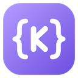
</p>

<h1 align="center">Kural Code Editor</h1>

<p align="center">
  An AI code editor in the style of Cursor.<br>
  Use <b>Claude</b> with your Claude Code login, or <b>your own model</b> on your computer: free, private, offline.
</p>

<p align="center">
  <a href="https://github.com/adithyakumarcr/kural/releases"></a>
  <a href="https://github.com/adithyakumarcr/kural/actions/workflows/build.yml"></a>
  
  
  
</p>

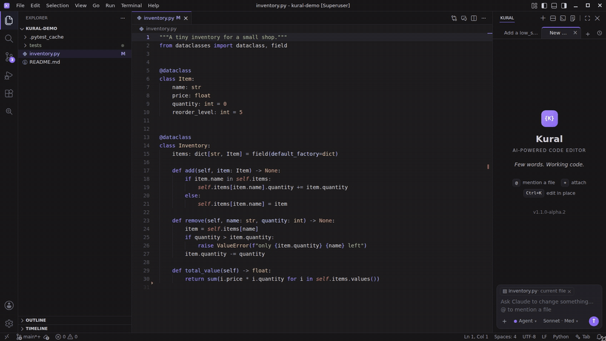

## What is Kural?

Kural is [VSCodium](https://vscodium.com) (the open-source build of VS Code) with an AI assistant built in.
Everything you know from VS Code works the same: extensions, themes, settings, the terminal, Git.
On top of that, Kural adds:

- **A chat that edits your code.** Ask for a change; Kural reads your project, edits files, runs your tests, and you
  keep or undo each change.
- **Tab Completion.** Grey suggestions as you type; **Tab** accepts. Change a name, and Kural offers to change it in
  the other files that use it.
- **Inline edit (Ctrl+K).** Select code, say what to change, review it red/green.
- **Teams of agents.** A project team (Researcher, Architect, Developers, Tester, led by a Project Manager) that
  plans, gets your OK and builds, or agents that discuss a question and agree on an answer.

Its AI comes from any of these (set up one or all; you switch in the model menu):

- **Claude.** Kural runs Claude Code in the background with your Claude plan: Anthropic's most capable models, your
  Claude Code settings, MCP servers, skills and `CLAUDE.md` files. No API key, nothing extra to pay for.
- **Google Gemini and ChatGPT (Codex).** The same way, with your Google account (Gemini, through Google's Antigravity
  CLI: free, AI Pro or Ultra) or your ChatGPT plan (OpenAI's Codex CLI).
- **Your own model.** A model on your computer through [Ollama](https://ollama.com), run by Kural's own engine. No
  account, no subscription, no internet: your code never leaves your computer.

Every feature is explained in the **[Kural wiki](https://github.com/adithyakumarcr/kural/wiki)**.

## Install

### 1. Download Kural

Get the file for your computer from [Releases](https://github.com/adithyakumarcr/kural/releases). Versions marked
**Pre-release** (like `1.1.0-alpha.1`) are test versions.

| Your computer | File |
|---|---|
| **Mac with Apple Silicon** (M1–M5) | `Kural-…-macos-arm64.dmg` |
| **Ubuntu 22.04 / 24.04** (x64) | `kural_…_amd64.deb` |
| **Windows 10 / 11** (x64) | `Kural-…-windows-x64-setup.exe` (or the portable `.zip`) |

**Mac.** First [verify your download](#verify-your-download) (it's the check macOS can't do for Kural). Then open the
`.dmg` and drag **Kural** into **Applications**. Kural isn't signed with a paid Apple developer ID, so macOS blocks it
the first time: open it once, then **System Settings → Privacy & Security**, scroll down, **Open Anyway**. Only if macOS
says the app "is damaged" (and you verified the download), allow it in Terminal:

```bash
xattr -dr com.apple.quarantine /Applications/Kural.app
```

That turns off macOS's check for this one app; don't make it a habit for other downloads.

**Ubuntu.**

```bash
sudo apt install ./kural_*_amd64.deb
```

Open **Kural Code Editor** from your apps, or type `kural` in a terminal (`kural .` opens the current folder).

**Windows.** Run the setup. It installs for your user only, so you don't need admin rights. Windows will probably say
**"Windows protected your PC"** (Microsoft Defender SmartScreen) with only a **Don't run** button: Kural's installer
isn't code-signed yet, and Windows warns about every unsigned program it doesn't know. To install it anyway:
1. Click **More info** (the small underlined link under the text).
2. The window now shows the file's name and "Publisher: Unknown publisher". Click **Run anyway**.

Kural's own updates don't show this again (Kural downloads them itself). With the portable `.zip`, Windows would ask
on every start: before unzipping, right-click the `.zip` → **Properties** → tick **Unblock** → **OK**. If there's no
**Run anyway** at all, Windows 11's Smart App Control or your company's policy blocks unsigned programs: that needs a
signed release ([how releases get signed](docs/windows-signing.md)).

### 2. Get started (Kural walks you through it)

Kural opens a **Welcome** page with **Start**, **Recent**, and **Walkthroughs**. Choose **Get started with Kural → Set up
your AI** (or **Kural: Get Started** in the Command Palette). The setup page asks where its AI should come from, then
checks each step and helps with it. Any one is enough; you can add others later.

**Claude**
1. **Claude Code installed.** **Install for me** runs Anthropic's official installer in a terminal (or copy the command).
   Installed somewhere unusual? **Choose the claude file…**
2. **Logged in.** **Log in** opens your browser. You need a Claude Pro, Max, Team or Enterprise plan, or an Anthropic
   Console account; the free plan doesn't include Claude Code.
3. **A test.** One tiny request to Claude (Haiku). If it fails, the page shows the error and what it means.

**Google Gemini or ChatGPT (Codex)**
1. **Installed.** **Install for me** installs it in the background (Gemini: Google's installer; Codex: Homebrew or
   npm, whichever your computer has). The page shows its output as it runs, warns if it goes quiet, and
   any question the installer asks comes as a pop-up.
2. **Logged in.** **Log in** opens the login page in your browser. (Gemini logs in on its own screen: Kural reads
   it, asks you for the code Google shows in a pop-up, and closes it by itself when you're done.)
3. **A test.** One tiny request. Then their models are in the chat's model menu.

**Your own model**
1. **Ollama.** **Get Ollama** (on Ubuntu it runs the installer; on a Mac or Windows it opens the download page).
2. **A model.** Pick one you have, or download one that fits your computer's memory (the page suggests a few).
3. **A test.** One request to that model, the way Kural will use it.

The chat unlocks when one way passes. Until then nothing runs in the background, so there are no errors. Git and a
Tab Completion model are optional; the page shows whether you have them. If Claude breaks later (removed, logged out),
Kural notices and opens the page again. Open it any time: **Kural: Get Started**.

<p align="center">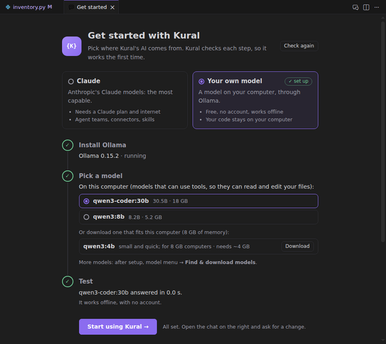</p>

### Updates

Kural checks GitHub for a newer release once a day (alpha, beta and rc test versions included) and offers it in a
small notification; it never installs without asking. Check yourself with **Help → Check for Updates…**, the Chat
panel's **…** menu, or Kural Settings (person icon in the status bar). Kural downloads the new version, installs it
and restarts: on Ubuntu it asks for your password; on a Mac it replaces Kural.app in place; on Windows it runs the
setup. (Setting `kural.updates.autoCheck` turns the daily check off.)

### 3. Optional: a local model for faster Tab Completion

Tab Completion with Claude takes about 0.6–0.9 s. For suggestions in about 150–300 ms, Kural can use a small code model
on your own computer through [Ollama](https://ollama.com). Click the **sparkle** icon in the status bar (Tab Completion),
pick **Local model**, then **Set up**: one click installs Ollama if it isn't there (the panel shows the download and
install progress; on Ubuntu it asks for your password) and downloads the model (1.5B is a good start).

## Features

### Chat (Ctrl+L)

The chat sits on the right and has tabs. Pick how much freedom Kural gets:

| Mode | What Kural may do |
|---|---|
| **Agent** | edits files (you keep or undo each one) and asks before running commands |
| **Auto** | edits and runs commands without asking |
| **Plan** | writes a plan without changing anything; **Build it** carries it out |
| **Ask** | only answers |

Also in the chat:

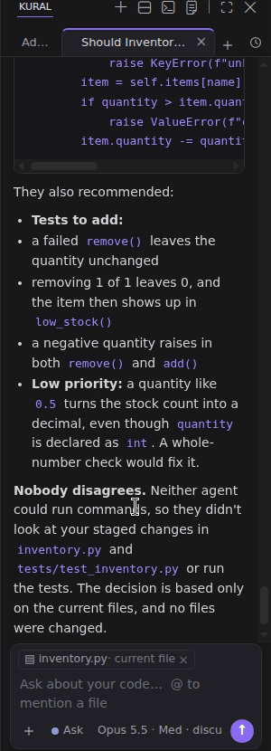

- **@ mentions.** Type `@` to mention a file in your sentence.
- **Jira tickets.** **+ → Link ticket** links a Jira epic, story or task to the chat. Search your recent tickets,
  a key like `PROJ-123`, or words. Claude then knows in every message which ticket you're working on, and reads
  its details (acceptance criteria, comments) from Jira when needed. This needs the Atlassian connector in Claude
  (claude.ai → Settings → Connectors); without it, the menu says so and how to connect it.
- **Devices (SSH).** **+ → Link device** saves a Raspberry Pi or board computer (name, address, username, password;
  the password is used once to set up Kural's own SSH key on the device, and isn't saved) and links it to the chat: the AI runs commands and
  changes files on it, asking first in Agent mode. Click its chip for a terminal on it.
- **Attachments.** **+ → Add files** adds files, images and PDFs. You can also paste a screenshot, or hold **Shift** and drag
  files from Kural's file explorer into the chat.
- **Questions with options.** When a choice is yours, Kural asks with options you can click.
- **Send while it works.** Enter while an answer runs doesn't stop it: your message is queued and the AI takes it in
  at its next step, inside the same answer ("You added this while it worked"), or answers it right after. **Stop** (or
  Esc) stops the answer and puts a queued message back into the box.
- **Model and intensity.** Claude's Opus / Sonnet / Haiku, Google Gemini and ChatGPT (Codex) models, or a model on your
  computer, and Low → Max. You can switch
  in the middle of a conversation; the new model gets the conversation so far.
- **Moods.** **Explorer** compares options, **Critic** pushes back, and **Learn** teaches you: it first asks which
  ideas behind your question you already know, explains the others, answers, then checks you got it. **Add your own
  mood…** makes your own (a name, a hint, instructions for the AI; Kural Settings → Moods).
- **Edit, restore, fork.** Hover a message you sent: **Edit** it and send again, **Restore code** (the files the AI
  changed after it go back), or **Fork from here** (a new chat with the conversation up to that point).
- **Notifications.** When an answer is done or needs you (a command to allow, a question) and you're not looking, a
  system notification names the chat; click it to go there. macOS asks once whether Kural may send notifications.
  Setting `kural.notifications`.
- **Did you know?** While an answer is being worked on, a short Kural tip or programming fact shows under it.
- **Pictures.** Pictures in answers are shown: from your project, ones the model read, or ones an image model made.
  A picture from the internet waits for a click (loading it would tell that website you read the answer).
- **Ask about Kural.** "How do I …?", "can Kural …?": the chat knows Kural's features, and if Kural can't do something
  it says so and links to [a feature request](https://github.com/adithyakumarcr/kural/issues/new?template=feature_request.yml).
- **Two chats at once.** Drag a chat tab out of the Kural panel into the editor area: it opens there, split like VS
  Code's editors (beside, above or below), with its own tabs and input. Both can work at the same time.
- **History.** The clock button lists every chat, from every workspace, in full. Search them, pin the ones you
  need on top, delete what you don't (it asks once). A chat from another workspace opens to read; to carry on, open
  its folder, or **Continue here** (a new chat here that knows the old conversation).
- **How it worked.** The AI's thoughts, reads, searches, commands and edits fold into one line above its answer
  ("Worked for 18 s · 7 thoughts, 2 reads, 3 edits"); click it to see each step.

<br clear="right">

### Models on your computer (offline)

Besides Claude's models, Kural can use a model that runs on your own computer through [Ollama](https://ollama.com):
private, free, and it works without internet or any account. Kural runs it with its own engine (no Claude Code): it
reads and edits files, searches your project, and asks before running commands, like with Claude. **Ctrl+K**,
**Apply** and commit messages use the chat's model too (**Ask** uses the fastest model you have: your own only when
there's no cloud AI). (Agent teams and Claude Code connectors need a Claude model.)

In the model menu, **On this computer** lists your models; **Find & download models…** searches Ollama's library
(models that can use tools, which the chat needs), shows how much memory each size needs compared to your computer,
and downloads with one click.

Local models are slower and less capable than Claude, and bigger ones need a lot of memory: on a laptop, start with
something like `qwen3:8b`; `qwen3-coder:30b` or `gpt-oss:20b` need about 20 GB. You need Ollama 0.8 or newer.

### Multiple agents

Turn on **Multiple agents** in the model menu with **Claude, ChatGPT (Codex) or Google Gemini**. The lead agent gets a
team named after Friends (Rachel, Ross, Monica…), each with a role you pick. Claude agents use a shared board;
Kural forwards Codex and Gemini agents' reports between phases. The roles:

| Role | Does |
|---|---|
| **Project Manager** (the lead, always there) | Gets the requirements from you, asks you when something is unclear, runs the team, reports back |
| **Researcher** (Rachel) | Searches online and in the code, writes a plan and proposes it to the Architect and the PM |
| **Architect** (Ross) | Studies the current architecture and picks the best solution; splits the work into parts |
| **Developers** (Monica, Chandler, Joey) | Build the approved plan, each their own part. The PM decides how many (1–3) |
| **Tester** (Phoebe) | Checks every piece of code that gets written: quality, tests, edge cases |

Pick any combination (Researcher + Developer, Researcher + Architect, all four…). Then how they work:

- **Split the work** (a project). The PM asks you what's unclear; the Researcher and Architect plan; **you OK the
  plan** (Go ahead / Change the plan / Stop); the Developers build; the Tester reviews until the code is good. With
  only a Researcher and/or Architect, the plan is the result.
- **Discuss & decide.** Each forms their own view first. Then they argue it out and agree. The answer shows everyone's
  final position and any disagreement left.

You see the discussion live: every message the agents send each other appears in the answer as it's sent. Each
agent's card shows what it's doing right now, its thinking and its notes.

If agents take too long, **Finish now** (next to "Waiting for …") stops them and the lead answers with what it
has. An agent that shows no sign of life for 6 minutes is stopped by itself.

<p align="center">
  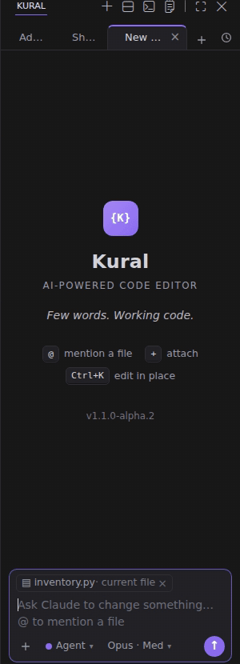
  &nbsp;&nbsp;
  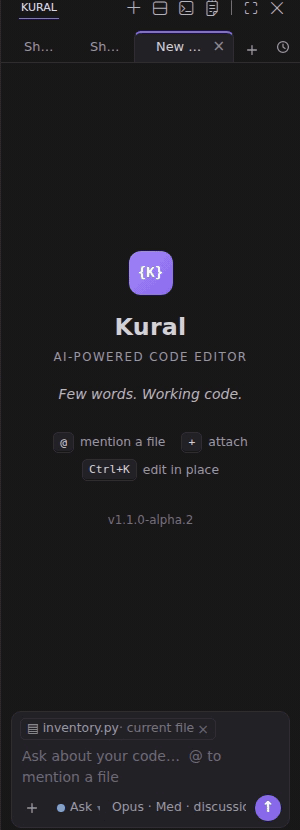
  <br>
  <sub>Pick the roles and how they work &nbsp;·&nbsp; Then they discuss and decide (sped up)</sub>
</p>

### Model Router

Choose **Auto → Balance, Cost or Intelligence** in the chat model menu, like Cursor's Auto. For every message Kural picks the model and the intensity from your Claude, Google Gemini and ChatGPT (Codex) models, switching between those AIs with the conversation handed over (models on this computer are only picked by you). It reads how much work the request is (Kural's own word classifier, or a helper model like Granite or Qwen3 Embedding for up to 90 % accuracy at under 50 ms), what you attached, how much of each AI's usage limit is left (**Cost** saves your limits), how long the conversation is, and what you did after its earlier answers. A quick question goes to a light model even under Intelligence, and complex work gets the most capable one even under Cost. Each answer shows the model; hover over it for the reasons.

Long chats transfer with an overview sized for the next model and a complete local record it can read to recover earlier details. Answered questions and attachments sent while an answer was running travel too. The same transfer happens when you switch providers or accounts yourself.

From 80 % of an AI's usage limit Auto moves to another AI, and an answer stopped by a limit carries on with another AI. The **Model Router** panel (its icon in the status bar) has only a slider from **Faster** to **Quality** for what reads your requests (four steps: Native, MiniLM, Granite, Qwen3; its info button explains each). There's no list of models to tick: Auto always uses every cloud model of the AIs you set up. Model ratings, Search & Ask ranking, chat context and Auto Tab engine selection are settings (`kural.modelRouter.*`). Claude and local models can change within their provider after completed tool failures; cross-provider handoffs occur between messages. See the [Model Router guide](docs/wiki/Model-Router.md) for setup, limits, privacy and measured routing overhead.

### Tab Completion

Suggestions appear as you type or when you place the cursor, also in the middle of a line. Write a comment, press
Enter, and the suggestion implements it. **Tab** accepts.

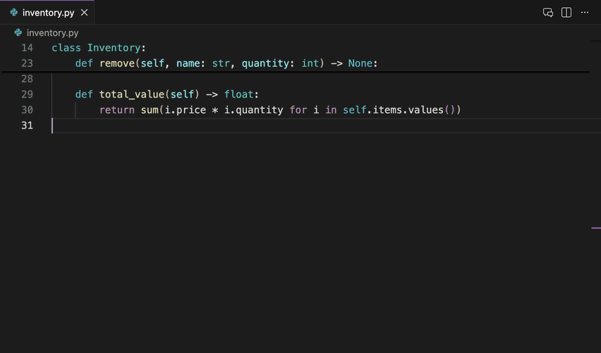

Click the **sparkle** icon in the status bar to turn suggestions on or off (crossed out while off). Open its panel
from **Tab Completion settings** in the icon's hover or **Kural Settings → Tab Completion**. There you can:

- turn suggestions on or off,
- set how quickly they appear,
- pick the engine: **Auto**, **Local model** or **Claude**, and its model,
- see how long the last suggestion took.

In **Auto**, the local model and Claude race, and the first good answer wins. With Model Router’s Auto Tab policy enabled (`kural.modelRouter.tab`), the router picks one engine from the profile setting. While a chat answers with a model on your computer, both share one graphics chip and the local suggestions slow down; then Claude helps (if it's set up), so suggestions keep coming.

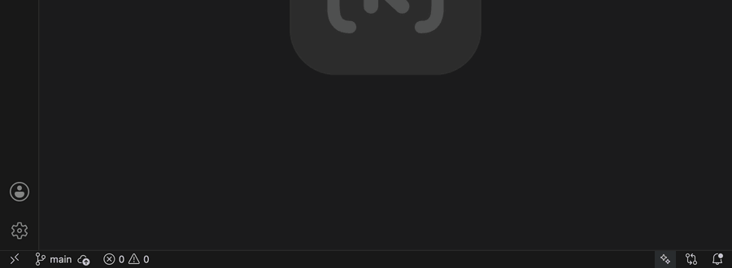

**Change a name, and Kural offers the rest.** Type over a name (or accept a Tab suggestion that changes it), and when
you move on, Kural looks for the old name in the rest of the project: "`total_value` became `stock_value` here. Also
change it in 1 other file?" **Review** opens Search & Ask filled in (whole word, same capitals, the new name in Replace);
**Change all** changes every place at once (Ctrl+Z undoes it). Setting `kural.tabCompletion.renameAcrossFiles`.

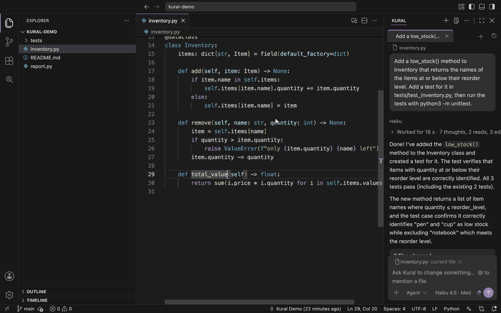

**Tab learns from your work.** The models themselves never change, so Kural tells them, with each suggestion, what
you've been doing in this workspace:

- what you asked the chat, and which files it changed for you,
- Ctrl+K and Apply changes you accepted,
- suggestions you accepted (your style),
- the file you just edited,
- the commands you run.

So a suggestion in a new file follows what you just wrote in another one. A commit message says why you changed
things ("params: reject zero speeds (controller crashed on 0)") in the style of your earlier commits. It's kept only
on this computer, per workspace. Commands with passwords or tokens are never kept. To clear it: **Kural: Forget What
Tab Completion Learned**.

### Tab in the terminal

In Kural's terminal, Kural suggests the whole command line in the terminal's suggestion list. **Tab** fills it in;
nothing runs until you press Enter. It's made for commit messages: type `git commit -m "` and Kural reads your
staged changes (or the unstaged ones) and suggests a message that names what changed. It also knows your recent
commands and `git status`. It uses the same engine and model as Tab in the editor (local model about 0.2 s, Claude
about 1–2 s). Turn it off with the setting **Kural › Tab Completion: Terminal**.

**Plain words work too.** Type what you want, like `push this code to fix/code-editor branch` or `commit with message
added the low stock check`, and Kural suggests the command (`git push origin HEAD:fix/code-editor`,
`git commit -m "Added the low stock check"`). Tab puts it in place of your words. These come from the chat's model.

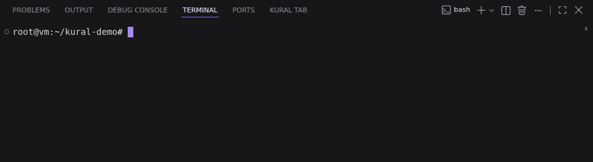

### Inline edit (Ctrl+K)

Select code, press **Ctrl+K**, and say what to change. Then review the change in place and keep it
(**Ctrl+Enter**) or reject it (**Ctrl+Shift+Backspace**); on a Mac, Cmd instead of Ctrl. With nothing selected, Ctrl+K
writes new code at the cursor.

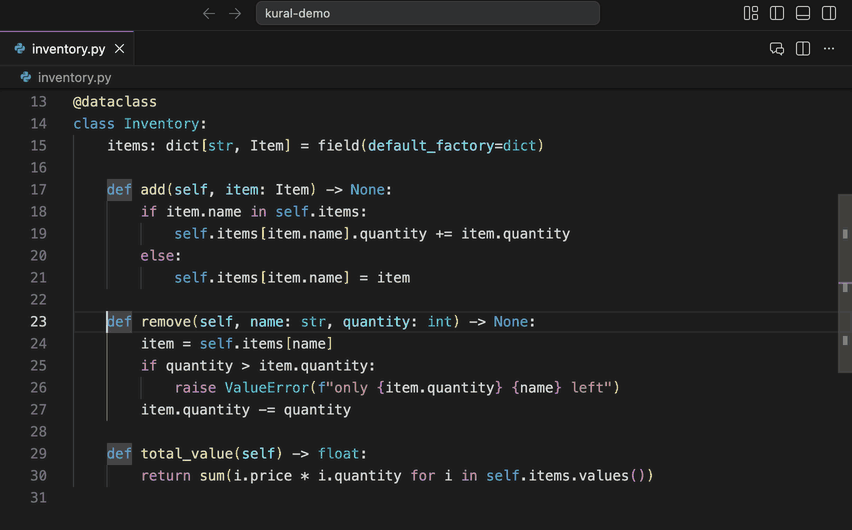

### More

- **Search & Ask** (magnifier icon). **Search** (Ctrl+Shift+F): find and replace in your files, with everything VS
  Code's own Search had (Kural hides that one). **Ask** (Ctrl+Alt+A): ask "where is the retry limit set?" and get the
  exact `file:line` places, from the fastest model you have (Claude's Haiku, or Gemini's or Codex's lightest).
- **Kural Settings** (person icon in the status bar, which shows your account's name): your accounts and usage,
  updates, the guide, in one tab.
- **Browser with Design Mode.** Real web pages inside Kural (your app on localhost, any site; every web link in a chat
  answer opens there). Click the inspect button, click an element, and it's added to the chat with its HTML, CSS and a
  picture; add a comment ("make this bigger") and Kural finds the code behind it and changes it, like Cursor.
- **Claude Code (Ctrl+Esc).** The full Claude Code terminal beside your file.
- **AI Usage** (bottom panel, next to Terminal). One compact summary per AI, showing its most used limit and reset
  time. **Details** expands other limits and token history. Click the chat's context ring to open it; hover the ring
  for tokens consumed and tokens in context. **Kural Settings → AI Usage** adds optional automatic switching at an
  editable percentage (70% initially): the same chat and its context continue with another available service below
  the threshold, after active work finishes. This works with manual models and Auto. The status bar
  shows the Session limit (`Claude Session 50% · resets 42m`; orange from 80 %, red from 95 %); hover for every limit,
  click for the panel.
- **A simpler window.** VS Code's Run and Debug side bar, Debug Console and Ports are hidden (while you debug with F5
  the debug views show anyway); the setting `kural.showDebugViews` brings them back. Tab Completion and Model Router
  are just icons in the status bar.
- **Light on memory.** Kural's Claude helpers start when they're first needed and stop after a few idle minutes, and a
  chat you haven't looked at for a while stops its Claude Code process until you come back to it
  ([measurements](docs/benchmarks/memory-2026-10-08.md)).
- **Asks before leaving your project.** The AI reads and changes your project's files freely; a file anywhere else gets
  a "Read this file?" / "Change this file?" card first. Kural never looks through Desktop, Documents, Downloads, Music
  or Photos by itself, so a Mac doesn't ask you about them.
- **Account** (person icon in the status bar). For Claude, Google Gemini and ChatGPT (Codex): who you're logged in as and your
  plan, the usage page, switch account, log out; and check for updates.
- **Your whole Claude Code setup.** MCP servers, connectors, plugins, skills, hooks and `CLAUDE.md` all work in the
  chat. When you add one, Kural reloads Claude in the same conversation.
- **Kural Dark and Kural Light themes** (pick one: Command Palette → *Preferences: Color Theme*): like VS Code's own,
  code in many colors, purple only for buttons and focus; and the same text size in the menus, side bar and chat as in
  the code. Every text color is checked to be easy to read (at least 4.5:1 contrast, the WCAG AA level). With *Window › Auto Detect Color Scheme* on, Kural follows your
  computer's light/dark mode.

## Keyboard shortcuts

On a Mac, use **Cmd** where it says Ctrl, except for the chat shortcuts marked *(Ctrl on Mac too)*.

| Shortcut | What it does |
|---|---|
| **Ctrl+L** | open the chat; with code selected, adds it to the message |
| **Ctrl+Alt+N** | new chat tab |
| **Ctrl+K** | inline edit |
| **Ctrl+Enter** / **Ctrl+Shift+Backspace** | keep / reject an inline edit |
| **Ctrl+Alt+Space** | Tab Completion on/off *(Ctrl on Mac too)* |
| **Ctrl+Alt+A** | Ask |
| **Ctrl+Esc** | Claude Code terminal |
| In the chat: **Ctrl+M / H / O** | intensity Medium / High / Max *(Ctrl on Mac too)* |
| In the chat: **Ctrl+P** | Plan mode on/off *(Ctrl on Mac too)* |

Inside the editor, Ctrl+K is Kural's inline edit. So VS Code's two-key Ctrl+K shortcuts don't work there, and Git's
moved to Ctrl+Alt+K. Use Ctrl+/ to comment code.

## Verify your download

Every release has a signed checksum list (`SHA256SUMS` and `SHA256SUMS.sig`), and Kural's updater checks it before
installing anything. You can check a download yourself too: see [docs/release-signing.md](docs/release-signing.md).

## What Kural stores on your computer

Kural keeps, on this computer only: your chat history (all chats, so you can reopen them), checkpoints for Restore code
(30 days), the update log, crash reports, Kural's own SSH key for devices you link, and, only if you turn it on, what
Tab Completion learns from your work. Nothing is sent to Kural's author. What you send to an AI goes to that AI's
company (Anthropic, Google or OpenAI), under your own account; a model on your computer sends nothing.

## Security

Found a vulnerability? Please report it privately, see [SECURITY.md](SECURITY.md).

## Build it yourself

No GitHub needed: one command builds Kural from the code in this folder and installs it on your computer
(a Mac with Apple Silicon, or Ubuntu / Debian):

```bash
./install.sh            # build and install (on a Mac it opens Kural when done)
./install.sh --ext      # changed only files in extension/? put them into the installed Kural in a few seconds
./install.sh --fresh    # install like a new user: your Kural settings and chats go to a backup folder first
./install.sh --from-scratch-install   # test as a brand-new user: Kural's data deleted (no backup), Claude Code,
                        # Codex and Antigravity logged out, macOS permissions for Kural reset; asks first
```

The first build downloads VSCodium once (about 250 MB, kept in `downloads/`). After that, a build takes about a
minute. On a Mac you need Apple's command-line tools once (`xcode-select --install`). `install.sh` sets up
everything else itself. After `--ext` on Ubuntu, reload the window (**Developer: Reload Window**). On a Mac,
Kural restarts.

The separate build scripts, if you only want the files in `dist/`:

| Computer | Command | Makes |
|---|---|---|
| Ubuntu (x64) | `./make-deb.sh` | `dist/kural_*_amd64.deb` |
| Mac, Apple Silicon | `./build-mac.sh` | `dist/Kural-*-macos-arm64.zip` and `.dmg` (needs Pillow: `python3 -m pip install Pillow`) |
| Windows (built on Linux) | `./build-win.sh` | `dist/Kural-*-windows-x64-setup.exe` + portable `.zip` (needs `nsis`, `node`; signed when a code signing certificate is set up: [docs/windows-signing.md](docs/windows-signing.md)) |

To run the tests (no Claude needed), use `npm test`.

## Releases

Releases are built by GitHub Actions (`.github/workflows/build.yml`):

- **Every push and pull request:** runs the tests and all three builds. The files are under the run's **Artifacts**.
- **A version tag:** does the same, then checks each build:
  - installs the `.deb` on Ubuntu 22.04 **and** 24.04 and opens it,
  - installs the Mac app from the `.dmg`, checks its signature and opens it,
  - installs the Windows setup silently and opens it.

  "Opens" means the real window must still be running after 25 seconds. `./install.sh` is tested on a Mac and on
  Ubuntu in the same run.

  Only then does it publish a GitHub Release with all the files.

To make a release:

1. Bump `"version"` in `extension/package.json`.
2. Add a `## What's new in X.Y.Z` block at the top of `RELEASE_NOTES.md`. It becomes the release text.
3. Merge it into `main` (through a pull request), then tag `main` and push the tag:

```bash
git checkout main && git pull
git tag v1.2.0
git push origin v1.2.0
```

The tag must match the version (`v1.2.0` ↔ `1.2.0`) and point to a commit on `main`. Otherwise the run stops early
and says why, and no release is made.

**Test versions.** Use a version like `1.2.0-alpha.1` (or `-beta.1`, `-rc.1`) and tag `v1.2.0-alpha.1`. GitHub marks it
as a **Pre-release**, so people see it's a test version. It uses the notes of `## What's new in 1.2.0-alpha.1`, or of
`1.2.0` if that block doesn't exist. On Ubuntu, the final `1.2.0` later installs over the alpha as an upgrade.

## Contributing

`main` is protected: nobody pushes to it directly, not even the owner. Changes come in as pull requests from a
branch or a fork. Each one needs the owner's approval (`.github/CODEOWNERS`), and the tests must pass. Only the
owner can create release tags (`v…`). See [CONTRIBUTING.md](CONTRIBUTING.md).

## Project layout

```
extension/            the Kural extension (plain JavaScript, no build step)
  extension.js        wires everything together
  lib/ai/             where answers come from: index.js (the provider table), claude.js (Claude Code headless),
                      codex.js (Codex app server), agy.js (Google Gemini: Antigravity, stream-json), clis.js (both described once), install.js,
                      engine.js + tools.js (Kural's own engine for models on your computer), ollama.js, usage.js
  lib/chat/           the chat: index.js (tabs, modes, models, questions, panes), prompts.js (modes, moods),
                      team.js (agent roles) + team-mcp.js (their message board), guide.js (what Kural can do),
                      archive.js (History), attachments, tickets, changes
  lib/tab/            Tab Completion: completion.js (editor), terminal.js (terminal, plain words), local.js
                      (Ollama), activity.js (what it learns), panel.js (the Tab Completion panel), rename.js +
                      rename-offer.js (change a name in the other files too)
  lib/edit/           Ctrl+K and Apply (inline.js), red/green review, diff
  lib/getstarted.js   Get started; lib/account.js accounts, lib/settings-page.js Kural Settings; lib/updates.js updates; lib/search/ Search & Ask
  media/              the panels' pages (HTML/CSS/JS) and the Codicons icon font
  themes/             Kural Dark, Kural Light (written by scripts/make-themes.py)
scripts/              shared rebranding (rebrand.py), logo, icons (make-status-icons.js), release notes, push-wiki.sh,
                      bench-memory.js (what a running Kural uses: memory and CPU per part)
installer/            the Windows installer (NSIS)
make-deb.sh           Ubuntu .deb    build-mac.sh  Mac app    build-win.sh  Windows
test/                 npm test
docs/                 screenshots for this README; docs/wiki/ the wiki's pages; docs/benchmarks/ measurements
```

## Troubleshooting

- **Kural: Show Log** (Command Palette, or Kural Settings) shows every request Kural makes, with timings.
- **"Kural: finish setup" in the status bar:** click it. Get started shows which step is missing (Claude Code, the
  login, or the test request) and how to fix it.
- **No Tab suggestions:** click the sparkle icon in the status bar (crossed out = off). The panel shows the engine,
  whether the local model is ready, and how long the last suggestion took.
- **More:** the [Kural wiki](https://github.com/adithyakumarcr/kural/wiki) explains every feature.
- **Mac says the app is damaged:** verify the download, then run the `xattr` command from [Install](#1-download-kural).

## Credits

By **Adithya Chinnakkonda**. Built on [VSCodium](https://github.com/VSCodium/vscodium) (MIT), with
[Codicons](https://github.com/microsoft/vscode-codicons) (CC BY 4.0) for icons. Kural is an independent project. It is not made or endorsed by Anthropic or
Microsoft. "Claude" is a trademark of Anthropic.

## License

Kural is free to use and change, for hobby projects and at work. What you may not do is **sell** it: no selling Kural
or a version of it, and no paid product or service whose value comes mainly from Kural (hosting, support, a rebrand).
That's the MIT license with the [Commons Clause](https://commonsclause.com/), see [LICENSE](LICENSE). Kural is
"source-available", not "open source" in the strict sense, because of this limit.

The VSCodium/VS Code parts inside Kural keep their own MIT license, and Codicons its CC BY 4.0 license.
